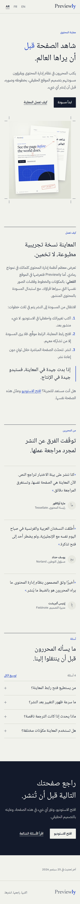
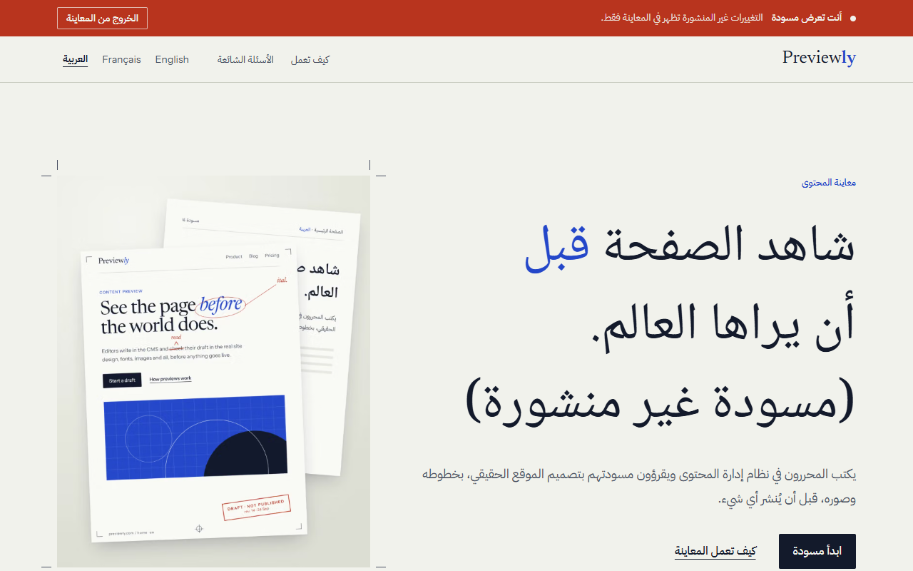

# Previewly

A multilingual marketing site (homepage, pages, blog) whose content lives entirely in Sanity, with real draft previews rendered in the production design, per-language on-demand revalidation, and full English / French / Arabic (RTL) support. No custom backend: the CMS is the data layer.

**Live:** https://previewly-wheat.vercel.app · **Studio:** `/studio`

**Stack:** Next.js 16 (App Router, Cache Components) · TypeScript · Tailwind CSS v4 · Motion · Sanity (embedded Studio, `@sanity/document-internationalization`) · next-intl

| | |
| --- | --- |
| Accessibility report | [docs/accessibility.md](docs/accessibility.md) |
| Screenshots | [docs/screenshots/](docs/screenshots/) |




## Contents

1. [Getting started](#getting-started)
2. [Architecture](#architecture)
3. [Key decisions](#key-decisions)
4. [Verification results](#verification-results)
5. [Known limitations](#known-limitations)
6. [Reference](#reference)

## Getting started

```bash
cp .env.example .env.local   # project ID, dataset, read token, webhook secret (+ an admin token for the seed)
npm install
npm run seed                 # writes pages, blog posts and translations (idempotent)
npm run dev                  # site on :3000, Studio on :3000/studio
```

| Script              | What it does                                                                       |
| ------------------- | ---------------------------------------------------------------------------------- |
| `npm run typegen`   | Extracts the Sanity schema and regenerates typed GROQ results (`sanity/types.ts`)  |
| `npm run typecheck` | `tsc --noEmit`                                                                     |
| `npm run seed`      | Idempotently writes demo content with fixed IDs (`createOrReplace`). Needs `SANITY_API_EDITORIAL_TOKEN`, an Administrator token that is **only** for this script: the site never reads it, so keep it out of Vercel and revoke it when you are not seeding |

## Architecture

```
Browser ──► proxy.ts (next-intl) ─ "/" → 307 to /en|/fr|/ar (cookie, Accept-Language, default)
              │
              ▼
   app/[locale]/…  (root layout: <html lang dir>, fonts, skip link, draft bar)
     page.tsx, [slug]/page.tsx        CMS pages   ┐
     blog/page.tsx, blog/[slug]/…     blog        ├─ sanity/lib/{pages,posts}.ts
     not-found.tsx, error.tsx         translated  ┘   'use cache' + cacheTag(locale, slug)
              │                                          │
              ▼                                          ▼
   components/blocks (registry → block components)   Sanity (published perspective)
                                                     Draft Mode → Viewer-token client, never cached

Sanity publish ──► signed webhook ──► app/api/revalidate ──► revalidateTag(page:<locale>:<slug>, …)
```

- **Content model** (`sanity/schemaTypes`): `page` (ordered `blocks[]`) and `post` (title, localised slug, excerpt, cover image + alt, author, date, tags, rich-text body). **One document per language**, linked by a `translation.metadata` document.
- **Block rendering** (`components/blocks/`): `BlockRenderer` looks each block up in `registry.ts`, which uses `satisfies` against the TypeGen block union, so a schema block with no component (or mismatched props) fails the build. Unknown `_type`s render nothing; each block is isolated by a try/catch on the server and a client error boundary.
- **Data fetching:** every read is a `'use cache'` function with `cacheLife('max')` and granular tags. Pages are static until an editor publishes; there is no time-based refetching. In Draft Mode the cache is bypassed entirely.
- **Routing and i18n:** every URL carries its locale. `next-intl` supplies messages, formatting and the locale-aware `Link`; the locale comes from the `[locale]` route segment (a Next root param), not a header, so pages stay statically prerenderable.
- **Types:** GROQ queries use `defineQuery` and TypeGen. Fields stay nullable on purpose: drafts can be half-filled, so components must cope with missing data.
- **Images:** a custom `next/image` loader maps `srcset` widths to Sanity CDN transforms; post-crop intrinsic dimensions prevent layout shift; LQIP gives the blur-up.
- **Design tokens** (`app/[locale]/globals.css`): Tailwind's default palette, radii and type scale are cleared, so only the design system's tokens exist as utilities. Direction "Proof": cool paper `#F1F2EC`, ink `#131A2B`, proof blue `#2447C9`, proofreader's red `#B8341E` reserved for draft state and errors; Newsreader + Instrument Sans (Latin), Noto Naskh Arabic + IBM Plex Sans Arabic (Arabic); hairline rules and crop marks instead of cards and shadows.
- **RTL:** logical properties only (`ms-`, `ps-`, `border-s`, `text-start`). Directional arrows flip; the wordmark, crop marks and digits do not. Arabic gets its own typography: no letter-spacing, taller leading, no italics.

### Adding a block type

1. Add a schema file in `sanity/schemaTypes/blocks/` and list it in `blocks/index.ts`.
2. Run `npm run typegen`.
3. Add a component in `components/blocks/` taking `BlockProps<"yourType">`, and one entry in `registry.ts`.

If the block holds images or references, also add a projection for it in `PAGE_QUERY`; plain fields are picked up by the `...` spread.

## Key decisions

### Option A: one document per language

Translatable content is modelled as **one Sanity document per language**, not a single document with per-field locale objects.

| | One document per language (chosen) | One document, per-field locale objects |
| --- | --- | --- |
| Editors | Each language has its own draft and Publish; French can ship before Arabic; structure can differ per market | One draft/publish for all languages; noisy forms |
| Queries | `language == $locale && slug.current == $slug`; localised slugs are natural | `coalesce(title[$locale], title.en)` on every field of every block |
| Fallback | Exists or doesn't: a clean, per-page decision the code can show honestly | Per-field, invisible: half-translated pages |
| Webhook | The changed document says which language changed | Can't tell which locale changed without diffing |
| Free plan | Plugin is free; roughly N× the documents | Fewer, larger documents |

Costs accepted: more documents, and structural edits are not propagated between languages automatically. Slug uniqueness is scoped per language (Sanity's default is dataset-wide), so `home` can exist in every locale.

### The fallback and its SEO

A missing translation serves the default-locale page inside the visitor's own chrome, with a small "not yet translated" notice (otherwise a French visitor gets English copy and can't tell a missing translation from a bug). The English body is wrapped in `lang="en" dir="ltr"`. Fallback pages are **`noindex, follow` with no canonical and no hreflang**. A canonical pointing at the English page would combine "drop this page" (noindex) with "merge it into that one" (canonical): contradictory signals. noindex alone is unambiguous, and a fallback is never advertised as a translation. hreflang and `x-default` list only real, published, indexable translations. If `/fr/pricing` is serving English and a French version is later published as `/fr/tarifs`, `/fr/pricing` redirects to it (307, because the translation can be unpublished again).

### The root URL

`/` is the only unprefixed URL. `proxy.ts` sends it to the `NEXT_LOCALE` cookie's locale (set when the visitor uses the language switcher), else the best `Accept-Language` match, else English, with a **307**: the destination differs per visitor, so it must never be cached as permanent.

### Two layers against malformed content

- **Studio validation stops editors from creating malformed content.** Required fields, length limits and URL rules run in the Studio, and Publish stays disabled until a document is valid.
- **Frontend fallbacks handle content that bypasses validation** (API writes and the seed, schema changes that add a required field, older documents, unfinished drafts that previews render). Every block therefore either hides itself or renders a reduced version, and never crashes the page.

The homepage passes validation so editors can always publish it. The deliberately broken fixtures live on a separate `/fixtures` page: `noindex`, out of the sitemap, read-only in the Studio.

### The stale draft cache fix

After "Exit preview" the editor could still see the draft bar and draft content, although the cookie was cleared. The exit control was a Server Action whose `redirect()` is a *soft*, client-side transition; when the target is the page the editor is already on, the router served its cached copy instead of re-fetching. The fix (`components/preview/preview-bar.tsx`) is a plain GET form to `/api/draft-mode/disable`, which forces a real page load with nothing cached to be stale. The redirect target is reduced to a same-origin path by `safeRedirectPath` before it is used, so the route is not an open redirect.

### The webhook API version (an earlier "pass" was luck)

During Phase 4 I updated the Sanity webhook through the management API and re-ran the live check, which passed: publishing French refreshed French. It passed by luck. The webhook was on API version v2021-03-25, which silently ignores the projection and delivers the raw document, so `slug` arrived as an object and the route treated every edit as a structural change, refreshing sibling languages too. The first live blog test exposed it: editing one French post also refreshed the English and Arabic indexes. The cause was in Sanity's webhook delivery log (`GET /hooks/projects/<id>/<hook>/messages` shows each payload; `/attempts` shows the route's response, which listed a tag `post:fr:[object Object]`). Fix: set the webhook to API version **v2025-02-19 or later**, and re-verify pages and posts (a plain edit now refreshes only its own language). Guard: `tagVersion` in `app/api/revalidate/route.ts` ignores any non-string slug, so an unprojected payload can never produce a nonsense tag.

### Revalidation is per language

Tags are `page:<locale>:<slug>`, `post:<locale>:<slug>` and `posts:<locale>` (a language's blog index). Publishing the French version refreshes that page (and, for a post, the French index) and nothing else. Siblings (their switcher and hreflang) and fallback URLs refresh only when a document's existence changes (first publish, rename, unpublish, noindex flip) or a `translation.metadata` document changes; fallback renders carry the default-language tag, so editing English refreshes the pages that show it as a fallback. The webhook must cover `page`, `post` and `translation.metadata`; its projection is documented in `app/api/revalidate/route.ts`. The route verifies the HMAC-SHA256 signature before touching anything (401 otherwise).

### Blog: index canonicals, search, digits

- **Index SEO.** `/blog` and `?page=N` are indexable with a self-referencing canonical (page N is not a duplicate of page 1). `?tag=` views are indexable with a self-referencing canonical: a tag is a small, stable topic listing, a useful landing page. `?q=` search results are `noindex, follow`: an unbounded space of thin near-duplicates. hreflang is declared only on the bare index, because tags are translated and a filtered view has no equivalent in another language.
- **Search is client-side filtering, not a GROQ query per keystroke.** The compact per-language list (no bodies) is already in the page, so results update within a frame (about 33 ms, two animation frames) with no network request and no API quota. The fold in `lib/blog-search.ts` handles Arabic (diacritics, tatweel, alef/ya/ta-marbuta variants) and Latin accents, which GROQ's `match` does not. The server renders the same filter for the URL, so the page is complete without JavaScript and every state is a shareable link. It scales to hundreds of posts per language; past a couple of thousand, move to server-side search and keep the URL shape.
- **Latin digits in Arabic.** Dates and numbers keep Latin digits in `/ar` ("24 سبتمبر 2026") by choice: they read consistently next to the Latin-script brand, codes and URLs. Month names and plural forms are Arabic. The numbering system is pinned to `latn` in `i18n/request.ts` and on the blog's number formatting; change it to `arab` to switch.

### Draft preview

An editor opens Presentation in the Studio, which mints a short-lived secret from their session and loads it through `/api/draft-mode/enable`. That route validates the secret against the dataset on the server, sets Next's signed Draft Mode cookie and redirects to a same-origin path. In Draft Mode the fetchers switch to a server-only client holding a **Viewer** token and bypass the cache, so a draft can never enter the published cache. A "Viewing a draft" bar (translated) renders over the same production components. Visitors without a valid secret always get the published page.

## Verification results

All measured on the deployed site unless noted.

- **Locales:** every page type renders in en, fr and ar at desktop and 390 px; Arabic mirrors correctly (logical properties, flipped arrows, unmirrored wordmark and digits); no horizontal overflow down to 320 px.
- **Fallback, hreflang, redirects:** fallback pages are `noindex, follow` with no canonical/hreflang; hreflang, `lang` and `dir` correct in source; Arabic slugs percent-encoded in canonical, hreflang and sitemap; the `/fr/pricing` → `/fr/tarifs` redirect works and reverts when the translation is removed; posts behave identically.
- **Revalidation:** editing one French page or post refreshed only that page (plus the French blog index for a post); everything else stayed cache HIT. First publish / unpublish refreshed siblings and fallbacks as designed.
- **Draft preview:** works for pages and posts in all three locales, with the translated bar; Exit preview clears it; visitors never see a draft.
- **Language switcher:** stays on the same page, follows localised slugs, handles untranslated pages, sets the `NEXT_LOCALE` cookie (one year), which `/` then honours.
- **Accessibility:** axe-core, 33 audits (every page type, three locales, draft bar): 15 violating nodes before, **0** after. Keyboard walkthrough, 320 px reflow and accessibility-tree review in [docs/accessibility.md](docs/accessibility.md). No real screen reader pass has been done yet (see limitations).
- **Reduced motion:** on the deployed blog index (en, fr, ar, page 2), posts (en, fr, ar, a fallback post) and the 404, with `prefers-reduced-motion: reduce` emulated, **0 transitions, 0 animations, and every scroll reveal at its resting state**. Before the fix the same check found leftover colour transitions (the header links) on **9 of 9** pages. It is now a global rule (`app/[locale]/globals.css`) plus Motion's `reducedMotion="user"`. Separately, the hero entrance is a CSS animation and the scroll reveals are un-hidden with JavaScript off (`@media (scripting: none)`): before, the hero heading was invisible until hydration and permanently invisible without JavaScript.
- **Lighthouse** (3 runs per configuration, deployed site, ranges across runs): three runs per configuration against the deployed site, on a modest laptop (Lighthouse's CPU benchmark scored 506 to 1178 across runs, below the ~1000 it expects for its reference device, so mobile TBT and LCP are pessimistic and noisy). Accessibility, Best Practices and SEO were **100 in every run**.

| Page | Form | Performance | LCP | TBT | CLS |
| --- | --- | --- | --- | --- | --- |
| Homepage `/en` | desktop | 87-97 | 1.1-1.5 s | 89-239 ms | 0 |
| Homepage `/en` | mobile | 54-72 | 5.1-5.2 s | 297-1113 ms | 0 |
| Blog post (en) | desktop | 88-97 | 1.3-1.7 s | 17-74 ms | 0 |
| Blog post (en) | mobile | 66-70 | 4.4-5.1 s | 518-646 ms | 0 |
| Arabic homepage `/ar` | desktop | 89-94 | 1.3-1.7 s | 8-133 ms | 0.003-0.004 |
| Arabic homepage `/ar` | mobile | 39-72 | 5.9-8.0 s | 274-2426 ms | 0-0.001 |

  Lighthouse found a real problem in the first set of runs (desktop 56-70, mobile 40-53): every public page downloaded the **whole Sanity Studio bundle** (about 1.9 MB gzip of JavaScript on the homepage) because the "Open the Studio" links were `next/link`s, which prefetch their target once in view. Links to `/studio` and `/api` are now plain anchors: homepage JavaScript dropped to about 0.2 MB gzip (a 9x cut) and total page weight to about 0.7 MB. Mobile is still the weak spot: the hero image is the LCP under simulated slow 4G, and hydration is the main-thread cost.

- **LCP pass on mobile (pagespeed.web.dev, before/after).** The LCP element on both the English and Arabic homepages is the hero image (the H1 paints first). PageSpeed showed the image was discoverable but had no `fetchpriority`, sat inside a 0.7 s fade-up entrance, and competed with four preloaded font files (about 330 KB, two of them italics the Arabic page never uses). Fixes: `fetchpriority="high"` on the hero image and no entrance animation on it; Newsreader self-hosted at its one used weight with the optical-size axis kept (272 KB to 120 KB, visually identical); the italic faces split into separate, non-preloaded families (font preloads 4 to 2); Noto Naskh Arabic at regular weight only (41 KB lighter). Mobile, simulated slow 4G. Before (single runs): `/en` 85-86, LCP 4.2 s; `/ar` 82, LCP 4.9 s. After (three independent runs each): **`/en` 92-93, LCP 3.2-3.3 s; `/ar` 80-87, LCP 3.9-4.7 s**. Observed, unthrottled LCP on the Arabic report was about 1.6 s (image load 10 ms): the remaining gap is Lighthouse charging the LCP for every byte that finishes before it. The Arabic page transfers about 490 KB first-party, of which Plex Sans Arabic in three weights is about 130 KB and JavaScript about 110 KB. Still open: dropping Plex weight 600 (a design call), and `LazyMotion` to trim about 20 KB of the animation library. Also fixed on the way: `:lang(ar) em` reached into the always-Latin wordmark and rendered its italic "ly" upright on Arabic pages.

## Known limitations

- **Hosting plan.** The site is deployed on Vercel's Hobby plan, which is for **non-commercial, personal use** only. Commercial use needs Pro (or another host).
- **Sanity plan.** The Sanity project's trial ends; this project deliberately uses only Free-plan features (Draft Mode, Presentation, Visual Editing, two GROQ webhooks, Viewer and Administrator tokens; no Content Releases or private datasets), but Free-plan limits on documents, API requests and seats apply, and each language multiplies documents roughly N×. Check the plan before launch.
- **No real screen-reader pass.** Only automated checks, scripted keyboard tests and the accessibility tree; an NVDA/VoiceOver pass on the Arabic pages is still owed. Translations were not reviewed by native speakers.
- **Blog search** is client-side and scales to hundreds of posts per language, not thousands.
- **Blog index** lists only posts that exist in that language; an untranslated post is reachable at its fallback URL via the language switcher.
- **Structural changes don't propagate between languages** (one document per language): adding a block to the English page does not add it to the French one.
- **Open Graph / Twitter cards** exist for posts, not for CMS pages.
- **The hero illustration** is a single raster showing an English page beside its Arabic translation; it is not localised per language.
- **The Arabic month names come from the runtime's ICU data**, not from the message files.
- **Fallback SEO trade-off:** `noindex, follow` without a canonical means a fallback URL is simply excluded; if the same content is reachable at many fallback URLs, only the source page is indexed.

## Reference

### Environment

See `.env.example`: `NEXT_PUBLIC_SANITY_PROJECT_ID`, `NEXT_PUBLIC_SANITY_DATASET`, `NEXT_PUBLIC_SITE_URL` (canonical origin for sitemap/hreflang), `SANITY_API_READ_TOKEN` (Viewer, server-only), `SANITY_REVALIDATE_SECRET` (webhook HMAC), and, locally only, `SANITY_API_EDITORIAL_TOKEN` (seed).

### Checking the dataset like the Studio does

```bash
SANITY_AUTH_TOKEN=<token> npx sanity documents validate -y
```

Only `page-fixtures` should report errors.

### Test content

The English-only `pricing` page exists to exercise the translation fallback; its Studio note says so. The seed also writes 7 English, 5 French and 4 Arabic posts with uneven coverage on purpose.
